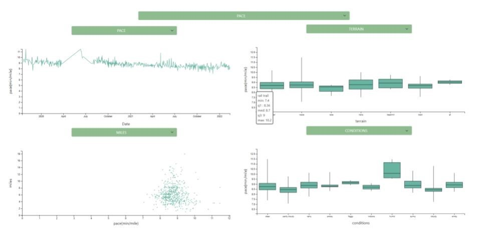

Collaborators: Alan Castillo, Connor Nelson, Dhruv Keyal, Owen Decleene, and Vani Korepu

## Description

We have a friend that is a running enthusiast, that collects data of every aspect of her running performance and puts it into a google spreadsheet. We decided to make a dashboard for her so that she can see the progress of her different running metrics and so that she can see the relationship between different aspects of her running, like how her physical and mental mood impact her pace or mileage.

__Heres what the default page looks like:__

## How to Run the Dashboard on Your Browser

The data is stored publicly in github, and is accessed directly by the code. Once you have all the files locally, either by cloning the git repo or by getting the zip, all you need to do is copy the path of the index.html file and paste and load it into your web browser. 

## D3 Usage

We implemented the code using HTML, CSS, JavaScript - using d3-graph-gallery as a resource to design our visualizations. Specifically, we utilized the trend, scatterplot and box-and-whiskers components through the d3-graph-gallery website. The site was also helpful in providing guidance for the tooltips feature to enhance interactivity. The bar chart and stacked bar chart visualizations were implemented seperately. 

Website: https://d3-graph-gallery.com/
